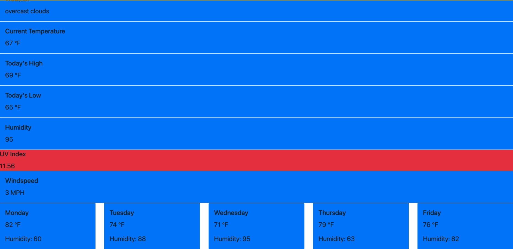

# Weather Dashboard

## Table of Contents

  * [Summary](#Summary)
  * [Tools](#Tools)
  * [Screenshot](#Screenshot/Video-Walkthrough)
  * [Collaborators](#Collaborators)

---

## Summary 

This project was built to help me understand how to use API's to enhance the usability of a website.
Using openweather API, I was able to create a weather dashboard which displays weather variables on the UI using data retrieved from the API.

---

## Tools

* HTML
* CSS
* Javascript

---

## Screenshot/Video-Walkthrough

---

## Github

https://github.com/cchester11

---
